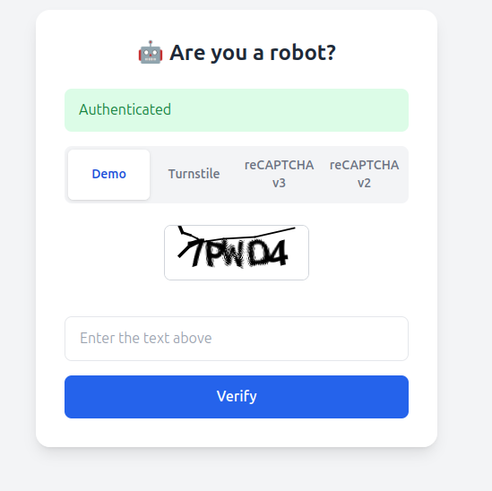
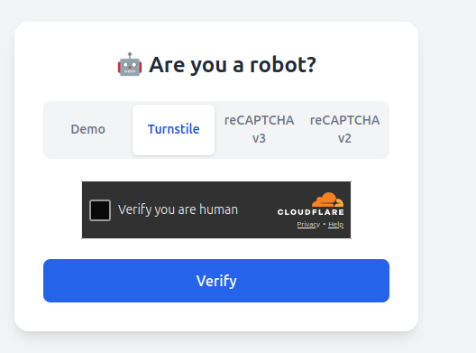
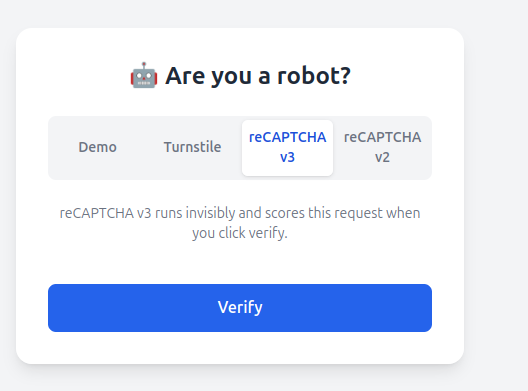
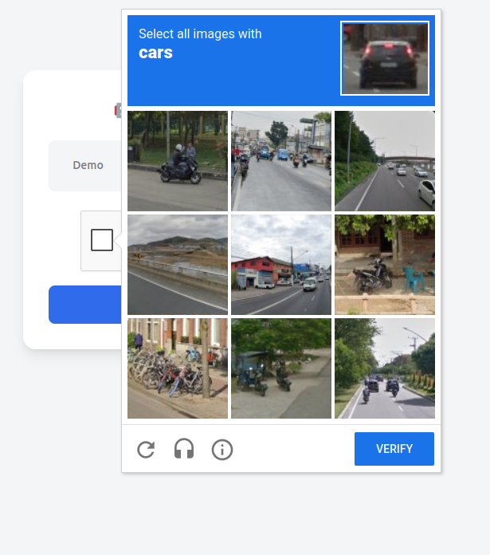

# Captcha Playground

A Spring Boot demo that implements and compares four different bot-mitigation
techniques side by side, from a classic distorted-image CAPTCHA all the way
to modern invisible, behavior-scored challenges. Each technique lives in its
own tab in the demo UI so you can try them one after another.

Stack: Java 17, Spring Boot 4, Thymeleaf, Tailwind (CDN), Caffeine cache.

## Running locally

```bash
./gradlew bootRun
```

Then open `http://localhost:8087`.

Out of the box, `application.yaml` ships with the **official public test
keys** published by Cloudflare and Google, so Turnstile / reCAPTCHA work
immediately on `localhost` with no signup. To use your own site, register
real keys and drop them into a git-ignored `src/main/resources/application-secrets.yaml`
(see `application-secrets.yaml.example`) — Spring merges it on top of
`application.yaml` via `spring.config.import`.

## The four tabs

### 1. Demo — classic distorted-text image CAPTCHA



The oldest style of CAPTCHA: the server (via the [Kaptcha](https://github.com/penggle/kaptcha)
library, see `KaptchaConfig.java`) generates a random string, renders it into
a PNG with noise and a "water ripple" distortion, and streams it to the
browser as a base64 data URI. The plaintext answer is never sent to the
client — only an opaque `captchaId` is, mapped server-side (Caffeine cache,
2-minute TTL) to the real answer (`KaptchaCaptchaServiceImpl`). The user
types what they read; the server compares the submitted text against the
cached answer and evicts it either way so a token can't be replayed.

**How it stops bots:** relies purely on OCR being harder than human reading
for a distorted, noisy image. It's the weakest of the four here — modern
OCR/ML models solve simple distorted-text captchas fairly reliably — but
it's fully self-hosted with no third-party dependency or network call.

### 2. Cloudflare Turnstile — invisible, non-interactive challenge



Turnstile renders a small widget (`TurnstileCaptchaService.java`) that
usually requires **zero interaction** from a legitimate visitor. Behind the
scenes, Cloudflare's JS runs a battery of passive signals in the browser —
lightweight proof-of-work computation, browser/environment fingerprinting,
and reputation signals from Cloudflare's global network — and only escalates
to a visible interactive puzzle if the visitor looks suspicious. On success
it hands the page a one-time `cf-turnstile-response` token.

The server never trusts that token blindly: it POSTs it, together with the
shared `secret-key` and the caller's IP, to Cloudflare's
`siteverify` endpoint and only accepts the submission if Cloudflare confirms
`success: true`.

**How it stops bots:** the proof-of-work step is cheap for one real browser
but expensive to run at bot-farm scale, and the fingerprint/reputation
signals flag headless/automated traffic even when the puzzle itself is
never shown.

### 3. reCAPTCHA v3 — fully invisible, score-based



reCAPTCHA v3 shows **no widget at all** — no checkbox, no puzzle. On submit,
the page calls `grecaptcha.execute(siteKey, {action})` (see `index.html`),
which silently runs Google's risk analysis (behavioral signals, browsing
history/reputation associated with the visitor, page interaction patterns)
and resolves to a token. The server exchanges that token with Google's
`siteverify` endpoint, which replies with a **score from 0.0 (bot) to 1.0
(human)** instead of a plain pass/fail (`ReCaptchaV3CaptchaService.java`).
This app accepts the request only if `score >= min-score` (default `0.5`,
configurable in `application.yaml`).

**How it stops bots:** because it's score-based rather than binary, the
integrating site decides what to do with low scores — block outright,
require a second factor, or route to manual review — instead of Google
unilaterally deciding pass/fail. The tradeoff is that it never presents a
challenge, so it can't stop a bot by making it "prove" anything; it can only
flag it.

### 4. reCAPTCHA v2 — the classic checkbox / image-grid challenge



The familiar "I'm not a robot" checkbox (`ReCaptchaV2CaptchaService.java`).
Clicking it runs the same kind of passive risk analysis as v3 in the
background; if Google's risk engine is confident, it just checks the box.
If not, it escalates to a visible interactive challenge (e.g. an image grid:
"select all squares with a bicycle"). Once solved, Google auto-populates a
hidden `g-recaptcha-response` field inside the widget, which is submitted as
a normal form field and verified server-side against `siteverify` — plain
success/fail, no score.

**How it stops bots:** combines the same passive signals as v3 with a hard
fallback that (at the time of writing) still requires solving a visual
puzzle most off-the-shelf bots can't reliably pass, at the cost of user
friction when it does trigger.

## Comparing the four

| Technique | User friction | Server trust model | Best for |
|---|---|---|---|
| Demo (image CAPTCHA) | Always types an answer | Exact string match | No external dependency, learning purposes |
| Turnstile | Usually none | `siteverify` pass/fail | Frictionless bot mitigation, privacy-friendly |
| reCAPTCHA v3 | None | `siteverify` risk **score** | Silent risk scoring, flexible thresholds |
| reCAPTCHA v2 | None -> checkbox -> puzzle if flagged | `siteverify` pass/fail | Strong fallback challenge when risk is high |

## Project layout

```
src/main/java/com/viettel/captcha/
├── CaptchaController.java            # routes for all four tabs
├── config/KaptchaConfig.java         # Kaptcha image-generator config
├── dto/                              # request/response records
└── service/
    ├── naive/                        # local image-captcha implementations
    └── realistic/                    # Kaptcha, Turnstile, reCAPTCHA v2/v3 services
```
